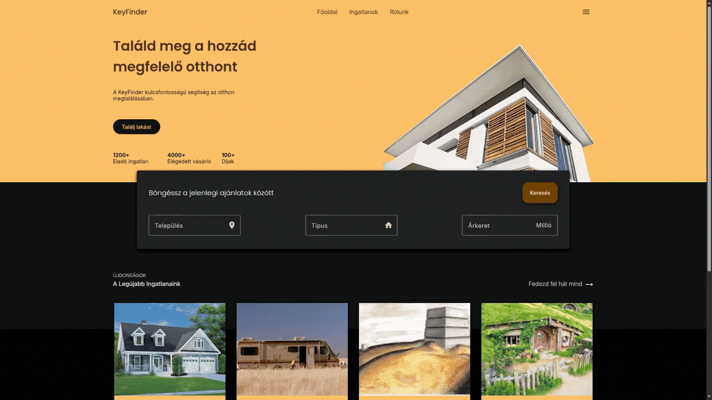
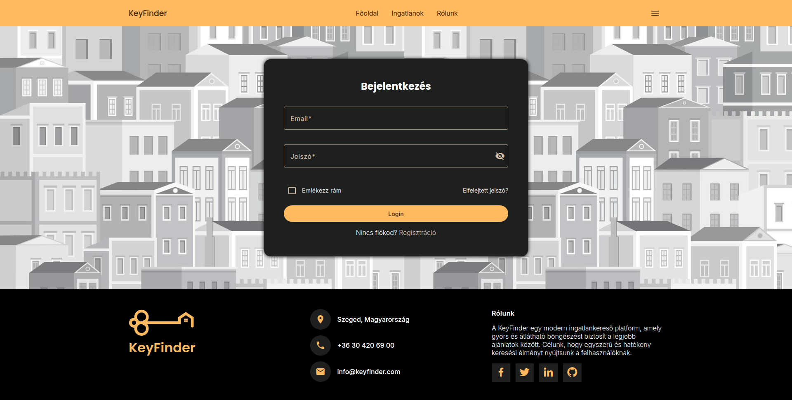
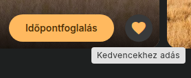
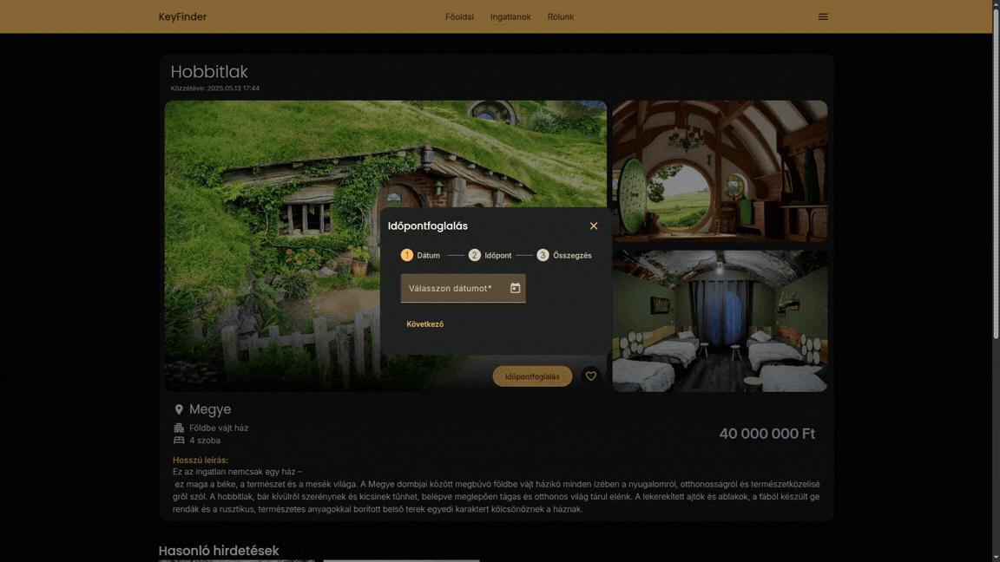

# KeyFinder: A Real Estate Finder Web Application

A modern real estate web application built with Angular and Firebase as part of a university project.
This was my first larger-scale Angular project and focused on building a feature-rich fullstack-style frontend application with authentication, database integration, advanced filtering, and responsive UI design.



## Live Demo

[Live Website](https://keyfinder-dd44c.web.app)

Test credentials:

- email: el@ado.hu
- jelszo: titkoselado

- email: ve@vo.hu
- jelszo: titkosvevo

## Project Overview

The application allows users to browse and manage real estate listings through an interactive and user-friendly interface. Users can create listings, search properties with advanced filters, save favorites, and book property viewings.

The project was designed to simulate a realistic property marketplace experience while also serving as practice for modern Angular development workflows and Firebase integration.

## Technologies Used

- Angular
- TypeScript
- Firebase Authentication
- Firebase Firestore
- Firebase Hosting
- Angular Material
- SCSS
- Various npm packages for UI and functionality

## Authentication System

Firebase Authentication is used for user management and secure access control.

Features include:

- User registration
- Login / logout
- Protected routes
- Session persistence



## Main Features

### Property Listings

Users can:

- Browse available real estate listings
- View detailed property pages
- Upload and manage their own listings


### Advanced Search Engine

The application contains a more advanced filtering and search system compared to a basic CRUD project.

Search options include:

- Property type
- Price range
- Location
- Additional property attributes

The goal was to create a more realistic marketplace browsing experience rather than simple static filtering.


### Favorites System

Users can save listings to a favorites collection for easier access later.



### Viewing Reservation System

Users are able to book property viewings directly through the application.



### Light / Dark Mode

The interface supports both light and dark themes to improve usability and user preference customization.


## UI & Design

The application uses Angular Material components combined with custom SCSS styling to create a modern responsive interface.

Focus areas included:

- Reusable UI components
- Responsive layouts
- Consistent visual hierarchy
- Improved user experience compared to smaller university projects

## Firebase Integration

Firebase services were heavily used throughout the project:

- **Firestore** for storing listings, user data, favorites, and reservations
- **Firebase Hosting** for deployment
- **Firebase Authentication** for account management

## Project Structure

```plaintext
/src
  /app
    /components
    /directives
    /pages
    /modules
    /pipes
    /themes
    /services
    /models
    /guards
    /shared
/public
  /assets
```

## Learning Outcomes

This project helped develop skills in:

- Angular application architecture
- Component-based frontend development
- Firebase integration
- State and data handling
- Authentication flows
- Responsive UI development
- Building larger-scale frontend applications

Compared to smaller course assignments, this project was significantly more complex and closer to a real-world application structure.

## Notes

This project was created in a month primarily for educational purposes as part of university coursework and personal learning.
